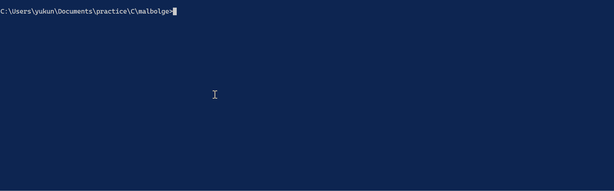

# Malbolge on C Language

## これはなに？

これは難解プログラミング言語の [Malbolge](https://ja.wikipedia.org/wiki/Malbolge) インタプリタのC言語実装です．

## ビルド方法

`make`コマンドでコンパイルしてください．
`bin`ディレクトリに実行ファイルができます．

## 遊び方

`bin`ディレクトリの実行ファイルを実行するとプロンプトが出るので好きな命令列を入力してください．
Enterで実行始まります
